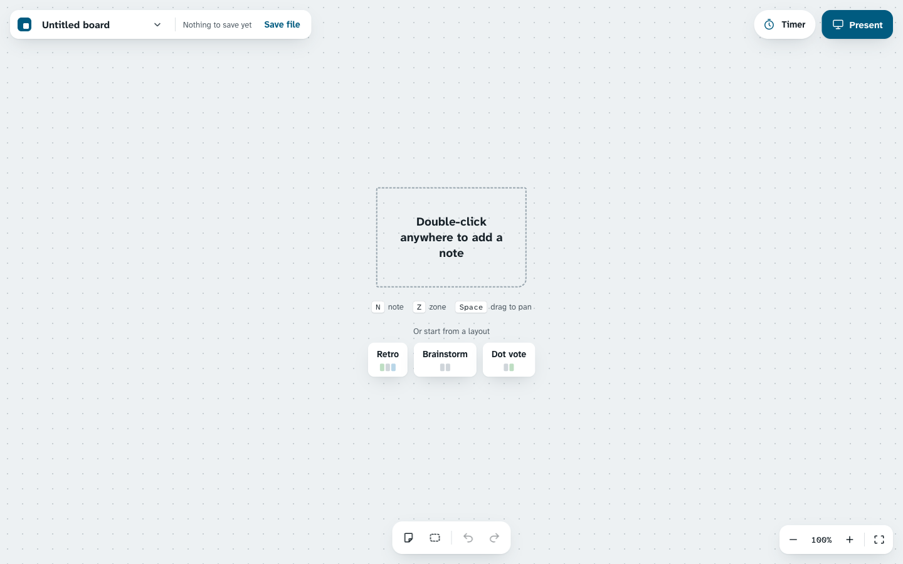
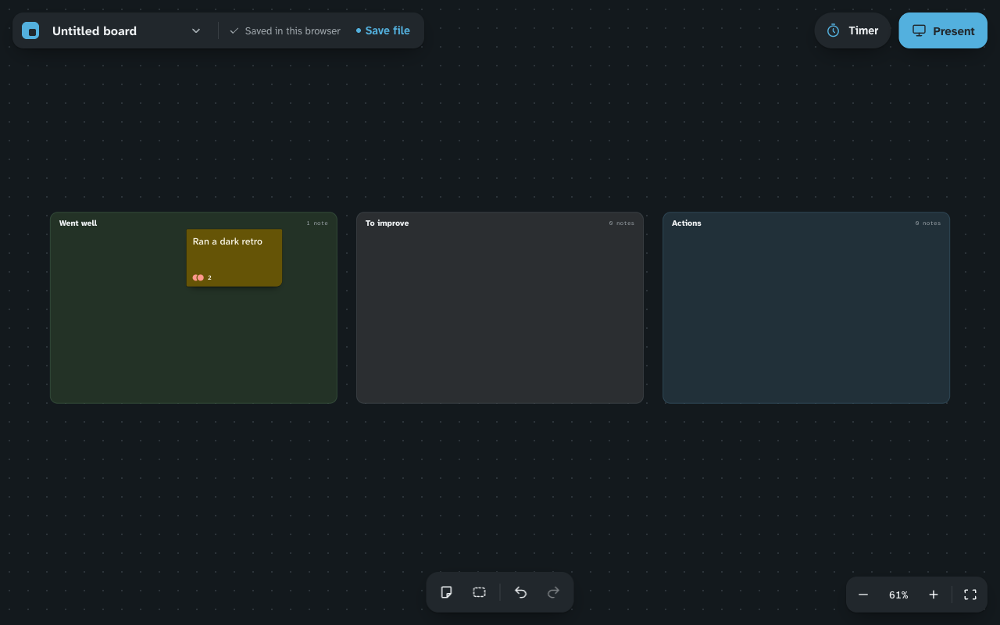

# Sessionboard

A sticky-note board for running a workshop from one screen.

One person drives. Everyone else reads along, from across the room or over a
shared screen. Present mode turns the board into the deck, so the notes you
just wrote are the slides you walk through. There is no account, no server and
no sign-in: the board lives in your browser and saves to a file you own.





## Quick start

Requires Node 20.19 or later. Node 21 is not supported, and from Node 22 the
floor is 22.12.

```bash
npm install
npm run dev
```

Then open http://localhost:5173.

| Script | What it does |
| --- | --- |
| `npm run dev` | Start the dev server |
| `npm run build` | Typecheck and build to `dist/` |
| `npm run preview` | Serve the built output |
| `npm run typecheck` | Types only, no output |
| `npm test` | Unit tests once |
| `npm run test:watch` | Unit tests in watch mode |
| `npm run e2e` | Playwright tests, desktop and touch |

## Using it

**Notes.** Double-click empty canvas to add one, then type. Escape commits.
Drag to move, or drag the bottom-right corner to resize. Eight colours, behind
one swatch in the toolbar that appears above a selection. That toolbar also adds dot
votes, which show as stickers along the bottom of the note.

**Zones.** Press `Z` for a zone, drag it by its header, and double-click the
header to rename it. A zone counts the notes whose centre falls inside it.

**Selecting.** Click a note, shift-click to add, or drag a band across empty
canvas. Without a pointer, Tab into the board, walk between notes with the arrow
keys, and press Enter to select one. Selected items move together, with the arrow keys as well as the
pointer.

**Getting around.** Hold space and drag to pan, or drag with the middle
button. Scroll or pinch to zoom, between 25% and 300%. The button at the
bottom right fits everything on screen.

**Starter layouts.** An empty board offers Retro, Brainstorm and Dot vote.
Each drops its zones centred in view as a single undo step.

**Timer.** Presets of 2, 5, 10 and 15 minutes, or anything from 1 to 180.
Name the exercise and the name shows in the pill. Under 30 seconds the pill
turns urgent, and it beeps once at zero.

**Present mode.** Press `P`. The board goes fullscreen, the tools disappear,
and you step through an overview followed by each zone in reading order, top
to bottom and left to right. Arrow keys, page keys and a presentation clicker
all work. Escape ends it and puts the view back exactly where it was.

**Themes.** System, Light or Dark, from the menu behind the board title. The
choice sticks. Light is the default, because a projector in a lit room washes
out a dark screen. A PNG export is always the light board whatever the app is
wearing.

### Keyboard

The board menu lists these too, under Keyboard shortcuts, so you never have to come
here to find them.

| Key | Action |
| --- | --- |
| `N` | New note in the middle of the view |
| `Z` | New zone |
| `P` | Start Present mode |
| `Tab` | Move into the board, then between the chrome |
| Arrows | Move between notes when nothing is selected; nudge the selection by 1, or 10 with Shift, when something is |
| `Enter` | Select the focused note, then again to edit it |
| `Delete` | Delete the selection |
| `Escape` | Stop editing, clear the selection, or end Present mode |
| `Ctrl`/`Cmd` `Z` | Undo, and `Shift Z` or `Y` to redo |
| `Ctrl`/`Cmd` `A` | Select every note |
| `Ctrl`/`Cmd` `D` | Duplicate the selection |
| Space and drag | Pan |
| `?` | Open the keyboard shortcuts sheet |

## Saving

**A file you own.** Save file writes `<board name>.board.json`, a plain JSON
document at format version 1 holding the notes, the zones and the viewport.
Open file… reads one back. That file is the thing to keep and share.

**A backup in the browser.** Every change is also written to `localStorage`, so
closing the tab by accident does not lose the board. It reloads on the next
visit. The file is still the real copy: browser storage is per browser, per
machine, and gets cleared.

**PNG export.** From the board menu. It frames everything on the board with a
40 unit margin, renders at twice the pixel size, hides selection chrome, and
draws the light theme on a white ground so the image suits a document or a
chat message.

## How it is built

React with TypeScript on Vite. State is one Zustand store holding a single
board document, with Immer for updates and an undo stack that records only the
changes that actually changed something. There is no backend.

```
src/model    the board document, its schema, the colour palette
src/store    board state, undo history, browser backup, transient UI state
src/board    canvas, notes, zones, selection, gestures, Present mode, layouts
src/chrome   the floating instruments: file pill, menu, dock, zoom, session bar
src/timer    the workshop timer and its settings
src/theme    theme choice and the root stamp
src/io       file save and load, PNG export
src/pwa      offline worker registration
tests/e2e    Playwright, desktop and touch
```

The PNG exporter is split into its own chunk and downloads only when someone
exports, since most sessions never do. A service worker caches the app on the
first visit, so a workshop can run with no network after that, and a web
manifest makes it installable. The worker is registered in production builds
only: in development it would serve stale modules.

Typography is Atkinson Hyperlegible, chosen for reading at a distance, and the
colours are tuned for a projector rather than a desk. Text and control pairings
were measured for contrast rather than judged by eye. Animations respect a
reduced motion preference.

Two documents explain the decisions behind all of this, including the ones that
were reversed:

- `docs/superpowers/specs/2026-09-15-card-board-design.md`
- `docs/superpowers/specs/2026-09-16-card-board-redesign-design.md`

## Not included

Real-time collaboration, deliberately. Sessionboard is one screen that a room
looks at together, not a document several people edit at once. Sharing happens
by saving the file, or by exporting a PNG.

The project was called Card Board until it was renamed. The two browser storage
keys still carry the old name on purpose, so that boards saved before the
rename still load.

## Licence

None chosen yet.
